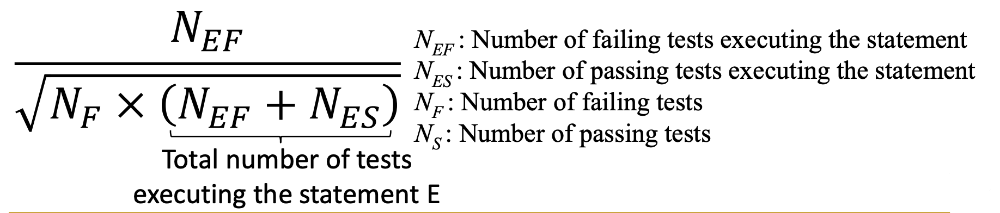

# Assignment 2 Frequently Asked Questions (FAQs)

If you have more questions on the assignment, please contact the TA

## Q1. I cannot run test cases generated by Evosuite in Eclipse/EclEmma fails to report coverage for the test cases generated by Evosuite

1. Remember to add `evosuite-standalone-runtime-1.0.6.jar` to your class path

2. Comment out the annotation before the test case class (XXX_ESTest:
```java=
@RunWith(EvoRunner.class) @EvoRunnerParameters(mockJVMNonDeterminism = true, useVFS = true, useVNET = true, resetStaticState = true, separateClassLoader = true, useJEE = true)
```
3. Remove the `extends *_ESTest_scaffolding`

## Q2. In the fault localization, how can we run each Junit test separately and get the execution results (pass/fail)?
There are multiple ways. 
Our suggestion is use the API `org.junit.runner.notification.RunListener`,  whose reference 
is [here](https://junit.org/junit4/javadoc/4.12/org/junit/runner/notification/RunListener.html).

Following is an example. Feel free to modify it to meet your requirements after you fully understand the reference.  


```java
import org.junit.runner.Description;
import org.junit.runner.JUnitCore;
import org.junit.runner.Result;
import org.junit.runner.notification.Failure;
import org.junit.runner.notification.RunListener;

public class JUnitTestRunner {
	public static void main(String... args) throws ClassNotFoundException {
		JUnitCore junit = new JUnitCore();
		junit.addListener(new RunListener() {
			public void testAssumptionFailure(Failure failure) {
			}

			public void testFailure(Failure failure) {
			}

			public void testFinished(Description description) {
			}

			public void testIgnored(Description description) {
			}

			public void testRunFinished(Result result) {
			}

			public void testRunStarted(Description description) {
			}

			public void testStarted(Description description) {
			}

		});
		// make sure the class file can be found in classpath. 
        Result result0 = junit.run(TestSuite.class);
        
	}
}
```

## Q3. What is the ranking of a statement if its suspicicous score is the same as that of many other statements?

In Task 2 and 3, we require you to use `Ochiai` ranking function as mentioned in the lecture slides: 


`Ochiai` computes suspicious score for each statement, while many of them may turn out to have the same score. 
To break this tie, we require you to compute the ranking for each statement based on the suspicious score, as mentioned in Task 2. 

In an extreme case, if you make the faulty statement have the highest suspicious score along with 100 other statements, the ranking of the faulty statement is `50th` instead of `1st`. 

